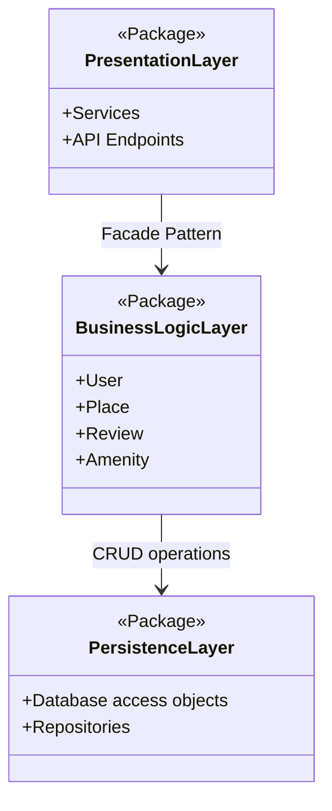

High-Level Package Diagram

Explanatory Notes

Presentation Layer
Handles all user interactions through services and API endpoints.
It provides a simplified interface for external communication.

Business Logic Layer
Contains the core logic and models (User, Place, Review, Amenity).
It enforces business rules and orchestrates operations between layers.

Persistence Layer
Manages data storage and retrieval.
It interacts directly with the database through Data Access Objects (DAOs).

Facade Pattern
The Presentation Layer communicates with the Business Logic Layer via a facade,
providing a unified and simplified interface.
This pattern decouples external services from internal complexity,
promoting modularity and maintainability.

