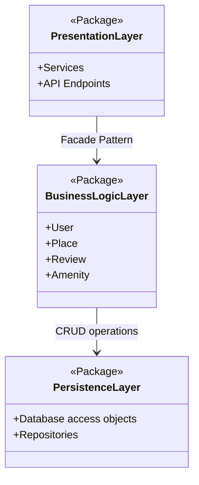

# High-Level Package Diagram
## Explanatory Notes

### Presentation Layer
This layer handles all user interactions through services and API endpoints. It acts as the system's entry point, providing a simplified interface for all external communication.

### Business Logic Layer
The core of the application, this layer contains the main models (User, Place, Review, and Amenity). It's responsible for enforcing business rules and orchestrating operations between the presentation and persistence layers.

### Persistence Layer
This layer is solely responsible for data storage and retrieval. It interacts directly with the database using Data Access Objects (DAOs) and Repositories to abstract database details from the business logic.

### Facade Pattern
The Facade pattern is the primary interface between the Presentation and Business Logic layers. It provides a single, unified point of contact that simplifies communication and decouples external services from the system's internal complexity, which improves modularity and maintainability.

