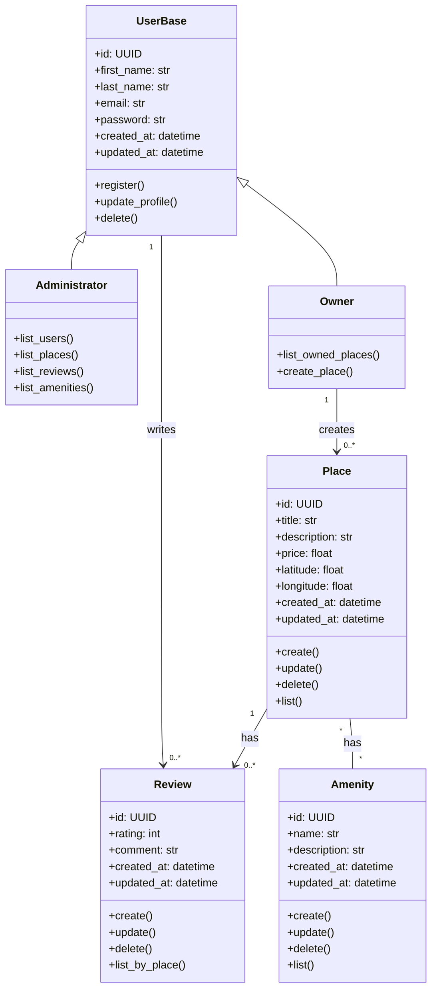

Detailed Class Diagram for Business Logic Layer

Explanatory Notes

User
Represents a person using the platform.
Includes attributes like name, email, password, and a boolean flag for admin status.
Users can register, update their profile, and be deleted.

Place
Represents a property listed by a user (the owner).
Includes attributes like title, description, price, and location coordinates.
Places can be created, updated, deleted, and listed.

Review
Represents a review posted by a user for a place.
Includes a rating and a comment.
Reviews are linked to both a user and a place.
Supports create, update, delete, and list operations.

Amenity
Represents a feature or facility offered by a place (e.g., Wi-Fi, parking).
Includes a name and description.
Amenities are associated with a specific place and can be managed through standard CRUD operations.

Relationships
A User can own multiple Places.
A User can write multiple Reviews.
A Place can have multiple Reviews and Amenities.
All relationships are modeled as aggregations, emphasizing ownership without strong lifecycle dependency.

