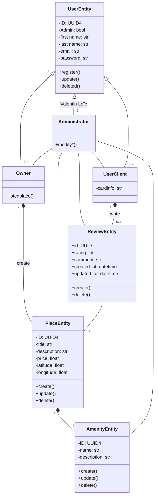

# Detailed Class Diagram for Business Logic Layer

## 1. Explanatory Notes

### UserEntity
This is the base class for all individuals interacting with the platform. It holds core identity information like first name, last name, email, and password, each stored as a string. A crucial attribute is Admin, a boolean flag that determines if the user has administrative privileges. Basic lifecycle methods for the user include register(), update(), and deleted(). The user is uniquely identified by a UUID4.

### Owner
The Owner class is a specific type of user that inherits from UserEntity. An owner's primary function is to manage their property listings, as indicated by the listedplace() method. The relationship between an Owner and a PlaceEntity is an aggregation, showing that Owner creates PlaceEntity instances.

### UserClient
This class represents a regular client user, also inheriting from UserEntity. It contains a specific attribute, cardinfo, for storing payment details. A UserClient can write ReviewEntity instances.

### Administrator
The Administrator class inherits from UserEntity and possesses elevated privileges. Its main function is to modify data across the system, as shown by its unique modify() method. An Administrator can interact with any other entity, including UserClient, Owner, ReviewEntity, PlaceEntity, and AmenityEntity.

### PlaceEntity
A PlaceEntity represents a property listing on the platform. Key attributes include title, description, price, latitude, and longitude. The class includes methods for create(), update(), and delete() to manage its lifecycle. Each PlaceEntity is uniquely identified by a UUID4.

### ReviewEntity
This class represents feedback from a client for a specific property. It contains rating and comment attributes. It is uniquely identified by a UUID and includes its creation and update timestamps for auditing purposes. The class has methods for create() and delete().

### AmenityEntity
An AmenityEntity represents a feature or facility associated with a place. It contains a name and description and is uniquely identified by a UUID4. It supports create(), update(), and delete() operations.

## 2. Relationships

### Inheritance:
The Administrator, Owner, and UserClient classes all inherit from UserEntity, sharing its common attributes and behaviors.

### User and Place:
An Owner can create and manage multiple PlaceEntity instances. This is an aggregation relationship with a multiplicity of 1..* between Owner and PlaceEntity.

### User and Review:
A UserClient can write a ReviewEntity. This relationship is also an aggregation with a multiplicity of 0..1 for ReviewEntity, meaning a review can only be associated with one client.

### Place and Review:
A PlaceEntity can have 0..1 associated ReviewEntity instances. A ReviewEntity is linked to a single PlaceEntity. This relationship is an aggregation.

### Place and Amenity:
A PlaceEntity is associated with 0..* AmenityEntity instances. This relationship is an aggregation, indicating that amenities can exist independently of a place.

### Admin Privileges:
An Administrator can interact with and modify instances of UserClient, Owner, ReviewEntity, PlaceEntity, and AmenityEntity, reflecting their oversight role.

