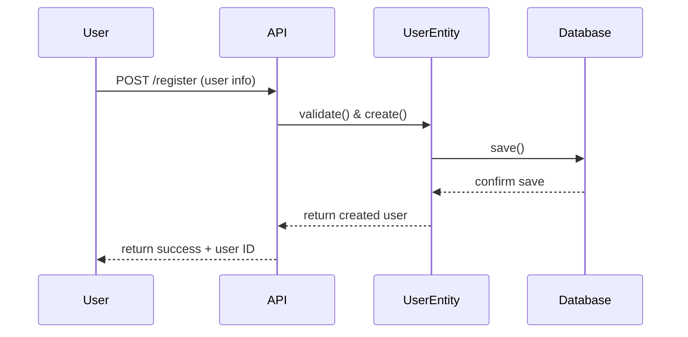
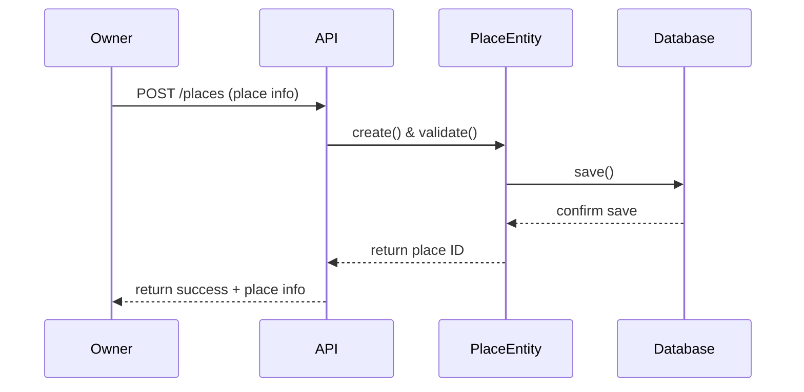
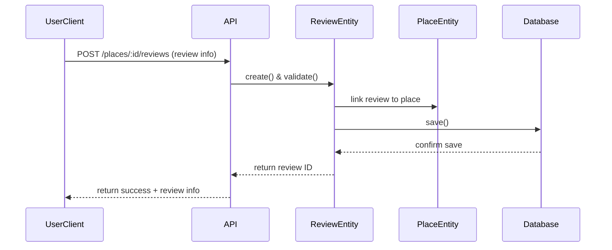
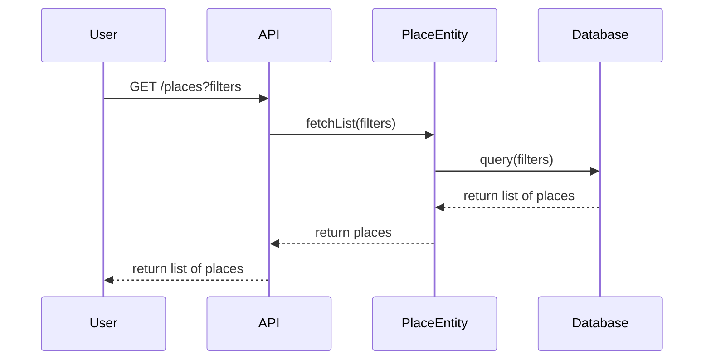

# Sequence Diagrams for HBnB API Calls

This document contains sequence diagrams (using Mermaid.js) and explanations for four different API calls in the HBnB application.  
Each diagram shows the interaction between the **Presentation Layer (API)**, **Business Logic Layer (Models/Services)**, and **Persistence Layer (Database)**.

---

## 1. User Registration

**Explanation:**  
- User sends registration details to the API.  
- API forwards the data to the UserEntity for validation and processing.  
- User data is inserted into the database.  
- A success response with a new `user_id` is returned.

---

## 2. Place Creation

**Explanation:**  
- User sends a request to create a new place.  
- API passes the request to the PlaceEntity.  
- The PlaceEntity creates a `Place` object and saves it to the database.  
- API responds with the new `place_id`.

---

## 3. Review Submission

**Explanation:**  
- User submits a review for a place.  
- API validates the request and forwards it to the RewiewEntity which is linked to a PlaceEntity.  
- Review is stored in the database.  
- API confirms creation with a `review_id`.

---

## 4. Fetching a List of Places

**Explanation:**  
- User requests a list of places with filters.  
- API passes the filters to the PlaceEntity.  
- Database query is executed with the filters.  
- A list of places is returned to the user.

---
