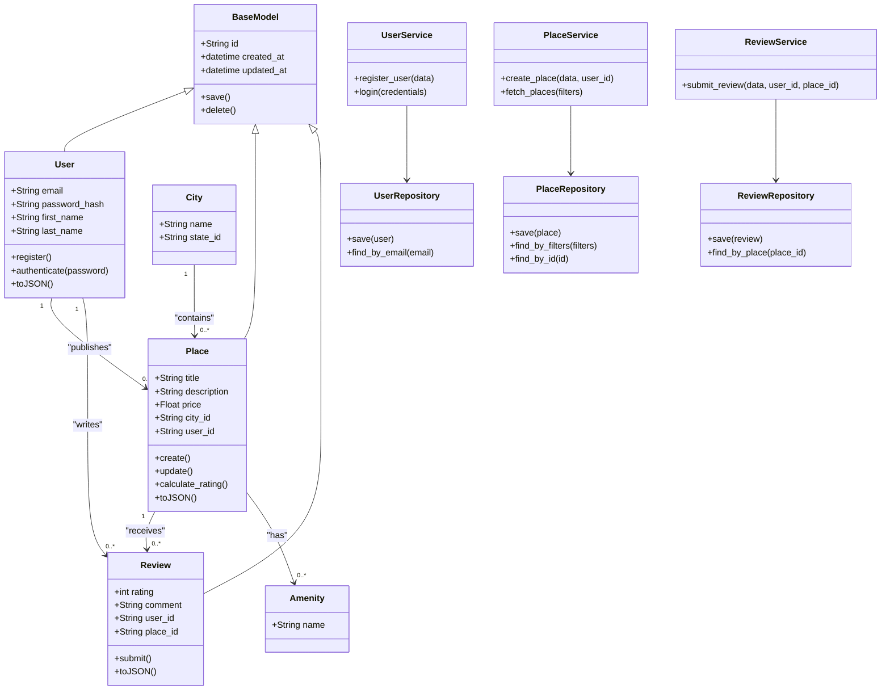
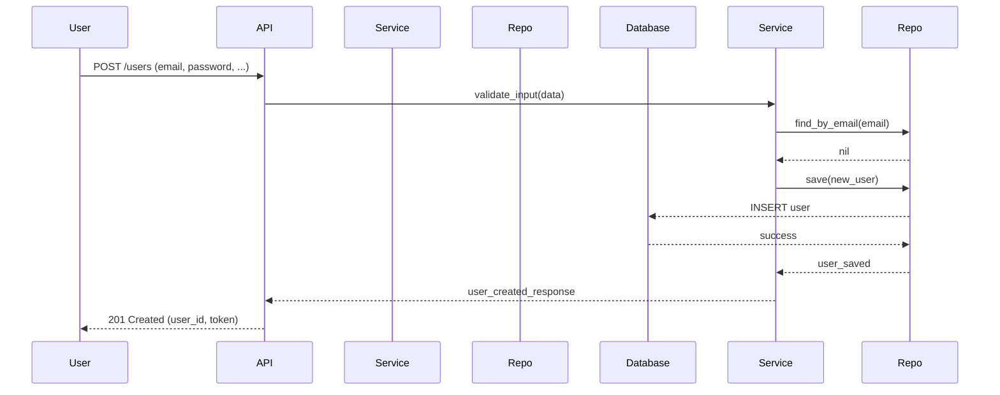
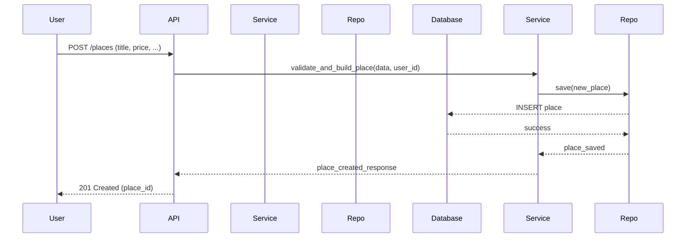
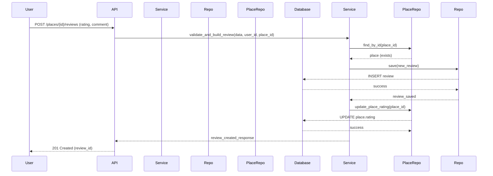
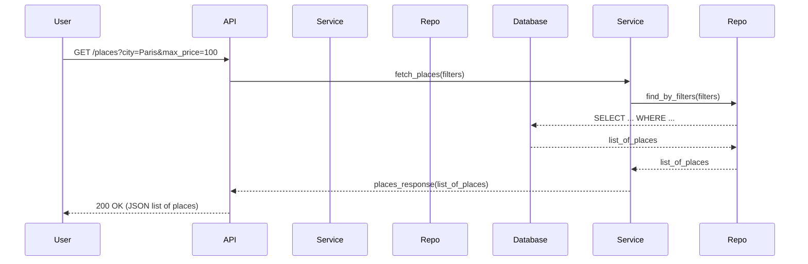

# Technical Documentation — HBnB

**Version**: 1.0  
**Contents**: diagrams (package, class, sequence), explanatory notes, design decisions, and delivery instructions.

---

## Introduction

This document consolidates the diagrams and explanatory notes required to understand the architecture and behavior of the **HBnB** application.  
It serves as a technical blueprint for implementation and maintenance. The document covers:

- Package diagram (high-level view)
- Detailed class diagram for the Business Logic layer
- Sequence diagrams for four key API calls
- Explanatory notes and design decisions

---

## 1. High-Level Architecture (Package Diagram)

The system is structured into three main layers: **Presentation**, **Business Logic**, **Persistence**.  
Below is a Mermaid representation of the package/architecture:

```mermaid
graph LR
  subgraph Presentation Layer
    API[API / Controllers]
    "Auth
Middleware" 
  end

  subgraph BusinessLogic Layer
    Services[Services]
    Models[Domain Models]
    Validators[Validators / Use Cases]
  end

  subgraph Persistence Layer
    Repositories[Repositories / ORM]
    Database[(Database)]
  end

  API --> Services
  Services --> Models
  Services --> Repositories
  Repositories --> Database
  API --> "Auth
Middleware"
```

**Purpose of the diagram**: to show separation of responsibilities and dependency flow (Presentation depends on Business Logic, Business Logic depends on Persistence).

**Design decisions**:
- Strict separation: controllers never access the database directly.
- Services / Use Cases centralize business logic, improving testability.
- Repositories encapsulate data access (ORM/SQL), allowing flexibility and easier testing.

---

## 2. Class Diagram — Business Logic Layer

The diagram below describes the main entities and their relationships: `BaseModel`, `User`, `Place`, `Review`, `City`, `Amenity`, along with the services and repositories.



**Explanation**:
- `BaseModel` provides common fields and behavior (id, timestamps, basic CRUD).
- Entities `User`, `Place`, `Review` inherit from `BaseModel`.
- Services (`UserService`, `PlaceService`, `ReviewService`) orchestrate business logic: validations, rules, transactions.
- Repositories encapsulate access to the database.

**Design choices**:
- Services maintain lightweight controllers (single responsibility).
- Repositories return domain objects (`Place`, `User`, etc.) rather than raw dicts for consistency.
- Domain logic (e.g., `calculate_rating`) resides in services or models depending on complexity.

---

## 3. Sequence Diagrams for API Calls

The following diagrams show the interaction flow between User (client), API (controllers), Business Logic (services/models), and Persistence (repositories/database).

### 3.1 User Registration



**Notes**:
- Check email uniqueness (`find_by_email`) before creating.
- Hash password in `UserService` before saving.
- Return token (JWT) if required by the spec.

---

### 3.2 Place Creation



**Notes**:
- Validate ownership (the user can create a place).
- Handle relationships (city_id, amenities) in the transaction.

---

### 3.3 Review Submission



**Notes**:
- Ensure user is allowed to post a review (e.g., only after booking).
- After saving, recalculate and update the place’s average rating.

---

### 3.4 Fetch Places



**Notes**:
- Pagination and limits recommended (`page`, `per_page`).
- Sanitize/filter inputs (prevent injection).
- Option: cache results for frequent queries.

---

## 4. Explanatory Notes and Design Decisions

### 4.1 Layered separation
- **Presentation (API)**: routes, auth, request/response handling.
- **Business Logic (Services/Models)**: rules, validations, orchestrations.
- **Persistence (Repositories/Database)**: transactions and data access.

Reason: maintainability, testability, easier evolution.

### 4.2 Transactions and consistency
- Multi-table operations (e.g., place + amenities) must run in atomic transactions.
- Services coordinate transactions (or delegate to ORM).

### 4.3 Validation and security
- Validate at API (format) and Service (business rules).
- Password hashing with bcrypt/argon2.
- JWT/sessions for authentication; verify roles/scopes.

### 4.4 Performance
- Use pagination, indexing on frequent queries (city_id, price).
- Possible caching with Redis.

---

## 5. Deliverables and Repo Structure

**Files to include in repo `holbertonschool-hbnb/part1`:**
- `docs/hbnb_technical_documentation.md` (this document)
- `docs/diagrams/package_diagram.mmd` (Mermaid, optional)
- `docs/diagrams/class_diagram.mmd`
- `docs/diagrams/sequence_diagrams.mmd`

**Commit suggestion (example)**:
```bash
cd holbertonschool-hbnb/part1
git checkout -b docs/technical-documentation
mkdir -p docs/diagrams
# copy docs/... files here
git add docs/hbnb_technical_documentation.md docs/diagrams/*
git commit -m "docs: technical documentation — architecture, class and sequence diagrams"
git push -u origin docs/technical-documentation
```

**Export to PDF** (optional):  
Use pandoc + wkhtmltopdf, or export from your editor (VS Code -> Print to PDF).
```bash
pandoc docs/hbnb_technical_documentation.md -o docs/hbnb_technical_documentation.pdf --pdf-engine=wkhtmltopdf
```
Note: Mermaid diagrams may not render automatically in PDF — render to HTML first, then export to PDF via browser.

---

## 6. Next Steps (recommended)
1. Review this document with your team/tutor.  
2. Add sample payloads (JSON requests/responses) for each API.  
3. Generate diagrams as PNG/SVG if needed for PDF inclusion.  
4. Write integration tests for critical flows (user registration, place creation, reviews).

---
