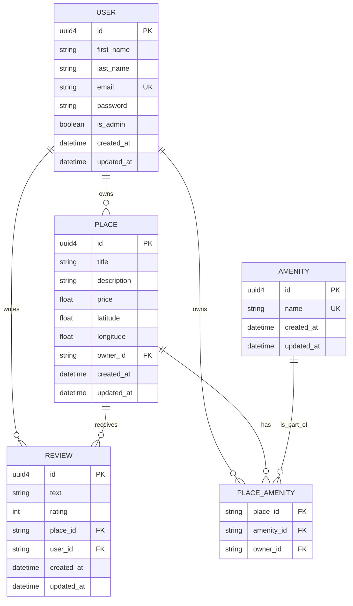

<div align="center"></div>

# HBnB Project - Auth & DB

## 🏠 Project Overview

Welcome to Part 3 of the **HBnB Project**. This phase marks a critical transition from a prototype using in-memory storage to a production-ready application featuring robust **data persistence**, **user authentication**, and **role-based authorization**.

The primary focus is to secure the API using **JSON Web Tokens (JWT)** and replace the volatile storage mechanism with a **SQLAlchemy** ORM layer backed by **SQLite** for development (with readiness for **MySQL** in production). This ensures the application is scalable, reliable, and secure for real-world deployment.

### Project Context

In the previous parts, we relied on in-memory storage, ideal for prototyping but insufficient for production. In Part 3, we transition to a **SQLite** database for development while preparing the system for **MySQL**. Additionally, we introduce **JWT-based authentication** and **role-based access control (RBAC)** to ensure only authenticated and authorized users can interact with specific endpoints.

---

## 🎯 Project Objectives

| Objective | Description |
| :--- | :--- |
| **Authentication & Authorization** | Implement JWT-based user authentication using **Flask-JWT-Extended** and enforce role-based access control with the `is_admin` attribute. |
| **Database Integration** | Transition from in-memory repositories to **SQLAlchemy** for ORM and persistence, utilizing **SQLite** for development. |
| **CRUD with Persistence** | Refactor all CRUD operations across the API layer, service layer (Facade), and persistence layer (Repository) to interact with the persistent database. |
| **Schema Design** | Design the relational database schema, mapping all entities (`User`, `Place`, `Review`, `Amenity`), and visualize it using **Mermaid.js**. |
| **Data Consistency** | Ensure data validation and constraints are enforced in the SQLAlchemy models. |

### Learning Objectives

By the end of this part, you will have gained experience in:
* Implementing **JWT authentication** to secure an API.
* Enforcing **role-based access control** (regular users vs. administrators).
* Replacing in-memory storage with a persistent database layer using **SQLAlchemy**.
* Designing and visualizing a relational database schema using **Mermaid.js**.

---

## 🛠 Technologies and Dependencies

| Category | Technology | Purpose | Resource |
| :--- | :--- | :--- | :--- |
| **Framework** | Flask | Core Python web micro-framework. | [Flask Official Docs](https://flask.palletsprojects.com/en/stable/) |
| **Database ORM** | SQLAlchemy | Object Relational Mapper for database interaction. | [SQLAlchemy Documentation](https://docs.sqlalchemy.org/en/14/) |
| **Authentication** | Flask-JWT-Extended | Handles JWT token generation, verification, and endpoint protection. | [Flask-JWT-Extended Docs](https://flask-jwt-extended.readthedocs.io/en/stable/) |
| **Security** | Flask-Bcrypt | Secure password hashing. | [Flask-Bcrypt Docs](https://flask-bcrypt.readthedocs.io/en/latest/) |
| **Visualization** | Mermaid.js | Generating visual Entity-Relationship Diagrams. | [Mermaid.js Documentation](https://mermaid.js.org/) |

---

## 🗺 Database Schema Visualization

The following Entity-Relationship Diagram (ERD) represents the final schema, detailing the primary keys (PK), foreign keys (FK), unique keys (UK), and all relationships between the core entities.



## 🚀 Running the Project

### Setup
#### Clone the repository:

```bash
git clone https://github.com/loicleguen/holbertonschool-hbnb/tree/main
cd holbertonschool-hbnb/tree/main/part3/hbnb/part3
```

#### Install dependencies:

##### Assuming you are in the 'hbnb/part3' directory
```bash
pip install -r hbnb/requirements.txt
````

#### Database Initialization:
Execute the SQL setup script to create the necessary tables and seed the initial admin user and amenities into your database (e.g., using a SQLite client).
Example using SQLite command-line tool
```
sqlite3 hbnb.db < setup_hbnb_db.sql
```

### Launch

#### Run the Flask application:
```bash
python3 hbnb/run.py
```

### Authentication Details

The initial administrator user is pre-inserted to allow immediate testing of protected endpoints:
| Field	| Value |
| :--- | :--- |
| Email	| admin@hbnb.com |
| Password	| admin1234 |
| Status	| is_admin: true |

To begin interacting with the secure endpoints, first send a POST request to /auth/login with these credentials to obtain a JWT Access Token. This token must then be included in the ``Authorization: Bearer <token>`` header for all protected API calls.

## Authors 
<div align="center">
  
| Author | Role | GitHub | Email |
|--------|------|--------|-------|
| **Loïc Le Guen** | Co-Developer | [@loicleguen](https://github.com/loicleguen) | 11510@holbertonstudents.com |
| **Valentin TIQUET** | Co-Developer | [@vtiquet](https://github.com/vtiquet) | 11503@holbertonstudents.com |
</div>