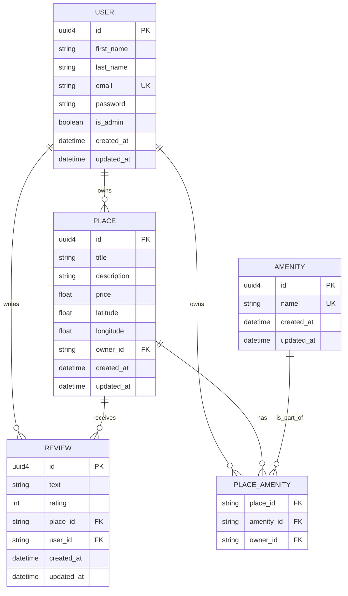

```mermaid
erDiagram
    %% Entities/Tables
    USER {
        uuid4 id PK
        string first_name
        string last_name
        string email UK
        string password
        boolean is_admin
        datetime created_at
        datetime updated_at
    }

    PLACE {
        uuid4 id PK
        string title
        string description
        float price
        float latitude
        float longitude
        string owner_id FK
        datetime created_at
        datetime updated_at
    }

    REVIEW {
        uuid4 id PK
        string text
        int rating
        string place_id FK
        string user_id FK
        datetime created_at
        datetime updated_at
    }
    
    AMENITY {
        uuid4 id PK
        string name UK
        datetime created_at
        datetime updated_at
    }
    
    %% Association Table for M:N Relationship
    PLACE_AMENITY {
        string place_id FK
        string amenity_id FK
        string owner_id FK
    }

    %% Relationships
    USER ||--o{ PLACE : owns
    USER ||--o{ REVIEW : writes
    PLACE ||--o{ REVIEW : receives
    USER ||--o{ PLACE_AMENITY : owns

    %% M:N Relationship decomposed via PLACE_AMENITY
    PLACE ||--o{ PLACE_AMENITY : has
    AMENITY ||--o{ PLACE_AMENITY : is_part_of
```