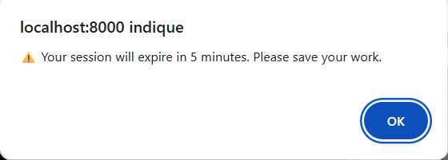
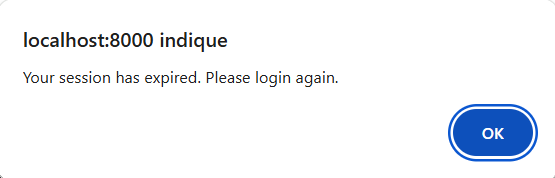

<div align="center">
  
</div>

# 🖥️ HBnB - Simple Web Client

This fourth and final phase focuses on building a dynamic front-end for HBnB using **HTML5**, **CSS3**, and **JavaScript ES6**. The client interacts with the backend API, providing a seamless user experience for authentication, browsing places, viewing details, and submitting reviews.

---

<a name="table-of-contents"></a>
## 📚 Table of Contents

- [Project Overview](#project-overview)
- [Design & Pages](#design--pages)
- [Login (JWT Authentication)](#login-jwt-authentication)
- [Index: List of Places](#index-list-of-places)
- [Place Details](#place-details)
- [Add Review Form](#add-review-form)
- [Technical Requirements](#technical-requirements)
- [Snippets](#snippets)
- [Test Video](#test-video)
- [Running the Project](#running-the-project)
- [Resources](#resources)
- [Author](#author)

---

## Project Overview
[⬆ Back to Table of Contents](#table-of-contents)

**Objectives:**
- Develop a user-friendly interface following provided design specifications.
- Implement client-side functionality to interact with the back-end API.
- Ensure secure and efficient data handling using JavaScript.
- Apply modern web development practices to create a dynamic web application.

**Learning Goals:**
- Apply HTML5, CSS3, and JavaScript ES6 in a real-world project.
- Interact with back-end services using AJAX/Fetch API.
- Implement authentication mechanisms and manage user sessions.
- Use client-side scripting to enhance user experience without page reloads.

---

## Design & Pages
[⬆ Back to Table of Contents](#table-of-contents)

**Pages to implement:**
- `login.html` – Login form for user authentication.
- `index.html` – Main page listing all places.
- `place.html` – Detailed view for a specific place.
- `add_review.html` – Form to add a review for a place.

**Required Structure:**
- **Header:** Application logo (`logo.png`) with class `logo`, login button/link with class `login-button`.
- **Footer:** Text indicating all rights reserved.
- **Navigation Bar:** Links to relevant pages (e.g., index.html, login.html).
- **Cards:** Use `.place-card` for places and `.review-card` for reviews.
- **Details:** Use `.place-details`, `.place-info`, `.details-button`, `.add-review` classes.

**Styling Requirements:**
- Margin: 20px for place and review cards.
- Padding: 10px within cards.
- Border: 1px solid #ddd for cards.
- Border Radius: 10px for cards.
- Color palette, font, images, and favicon are flexible and customizable.
- All pages must be valid on [W3C Validator](https://validator.w3.org/).

---

## Login (JWT Authentication)
[⬆ Back to Table of Contents](#table-of-contents)

- Implements login functionality using the backend API.
- Stores the JWT token returned by the API in a cookie for session management.
- Redirects to the main page (`index.html`) after successful login.
- Displays error messages if login fails.

**Example:**
```javascript
document.addEventListener('DOMContentLoaded', () => {
  const loginForm = document.getElementById('login-form');
  if (loginForm) {
    loginForm.addEventListener('submit', async (event) => {
      event.preventDefault();
      const email = loginForm.email.value;
      const password = loginForm.password.value;
      const response = await fetch(`${API_URL}/login`, {
        method: "POST",
        headers: { "Content-Type": "application/json" },
        body: JSON.stringify({ email, password })
      });
      if (response.ok) {
        const data = await response.json();
        document.cookie = `token=${data.access_token}; path=/`;
        window.location.href = "index.html";
      } else {
        alert("Login failed: " + await response.text());
      }
    });
  }
});
```

---

## Index: List of Places
[⬆ Back to Table of Contents](#table-of-contents)

- Displays a list of all places as cards.
- Fetches places data from the API and implements client-side filtering by price.
- Shows the login link only if the user is not authenticated.

**Example:**
```javascript
function getCookie(name) {
  const matches = document.cookie.match(new RegExp(
    "(?:^|; )" + name.replace(/([\.$?*|{}()\[\]\\\/\+^])/g, '\\$1') + "=([^;]*)"
  ));
  return matches ? decodeURIComponent(matches[1]) : undefined;
}

async function fetchPlaces(token) {
  const headers = token ? { "Authorization": `Bearer ${token}` } : {};
  const response = await fetch(`${API_URL}/places`, { headers });
  if (!response.ok) throw new Error("Failed to fetch places");
  const places = await response.json();
  displayPlaces(places);
}
```

---

## Place Details
[⬆ Back to Table of Contents](#table-of-contents)

- Displays detailed information about a place, including host, price, description, amenities, and reviews.
- Fetches place details from the API using the place ID from the URL.
- Shows the add review form only if the user is authenticated.

**Example:**
```javascript
function getPlaceIdFromURL() {
  const params = new URLSearchParams(window.location.search);
  return params.get("id");
}

async function fetchPlaceDetails(token, placeId) {
  const headers = token ? { "Authorization": `Bearer ${token}` } : {};
  const response = await fetch(`${API_URL}/places/${placeId}`, { headers });
  if (!response.ok) throw new Error("Failed to fetch place details");
  const place = await response.json();
  displayPlaceDetails(place);
}
```

---

## Add Review Form
[⬆ Back to Table of Contents](#table-of-contents)

- Only authenticated users can submit reviews.
- Unauthenticated users are redirected to the index page.
- Sends review data to the API and handles the response.

**Example:**
```javascript
async function submitReview(token, placeId, reviewText) {
  const response = await fetch(`${API_URL}/reviews`, {
    method: "POST",
    headers: {
      "Content-Type": "application/json",
      "Authorization": `Bearer ${token}`
    },
    body: JSON.stringify({ place_id: placeId, text: reviewText })
  });
  if (response.ok) {
    alert("Review submitted successfully!");
  } else {
    alert("Failed to submit review: " + await response.text());
  }
}
```

---

## Technical Requirements
[⬆ Back to Table of Contents](#table-of-contents)

- Use semantic HTML5 elements for structure.
- Responsive design with CSS3.
- All client-server communication via Fetch API.
- JWT token stored in cookies for session management.
- CORS must be enabled on the backend for API access.
- Client-side form validation and error handling.
- All pages must pass W3C validation.

---

## Snippets
[⬆ Back to Table of Contents](#table-of-contents)

Here is a snippet that sets an expiration for the token and the cookie.
```
function setCookie(name, value, hours = 1) {
    const expires = new Date();
    expires.setTime(expires.getTime() + hours * 60 * 60 * 1000); // Convertir heures en millisecondes
    document.cookie = `${name}=${value};expires=${expires.toUTCString()};path=/`;
    
    console.log(`Cookie "${name}" set for ${hours} hour(s)`);
}
function setTokenExpiration(hours = 1) {
    const expirationTime = new Date().getTime() + (hours * 60 * 60 * 1000);
    localStorage.setItem('tokenExpiration', expirationTime);
    console.log(`⏰ Token will expire in ${hours} hour(s)`);
    setCookie('token', data.access_token, 1); // 1 hour
    setTokenExpiration(1); // 1 hour
}
```
Upon expiration, they are automatically deleted, and an auto-logout is triggered.
There is also a warning message five minutes before the logout.
```
/**
 * Start a timer to auto-logout when token expires
 */
function startExpirationTimer() {
    const expirationTime = localStorage.getItem('tokenExpiration');
    
    if (!expirationTime) return;
    
    const now = new Date().getTime();
    const timeUntilExpiration = parseInt(expirationTime) - now;
    
    if (timeUntilExpiration <= 0) {
        checkTokenExpiration();
        return;
    }
    
    const warningTime = timeUntilExpiration - (5 * 60 * 1000);
    
    if (warningTime > 0) {
        setTimeout(() => {
            if (getCookie('token')) {
                alert('⚠️ Your session will expire in 5 minutes. Please save your work.');
            }
        }, warningTime);
    }
    
    setTimeout(() => {
        deleteCookie('token');
        localStorage.removeItem('tokenExpiration');
        alert('Your session has expired. Please login again.');
        window.location.href = 'login.html';
    }, timeUntilExpiration);
}
```
<div align="left">
  
</div>
<div align="left">
  
</div>

---

<a name="test-video"></a>
##  Test Video
[⬆ Back to Table of Contents](#table-of-contents)

Here’s a short video showing how to use HBNB.
[**Video link**](https://youtu.be/fYF85jYeWRg)

---

<a name="running-the-project"></a>
## 🚀 Running the Project
[⬆ Back to Table of Contents](#table-of-contents)

### Clone the repository:

```bash
git clone https://github.com/loicleguen/holbertonschool-hbnb/tree/main
```

### Install dependencies:

##### Assuming you are in the 'hbnb/part4' directory
```bash
pip install -r hbnb/requirements.txt
````

### Launch

#### Run the Flask application in two terminals:
```bash
cd holbertonschool-hbnb/tree/main/part3/hbnb/part3
python3 hbnb/run.py

cd holbertonschool-hbnb/tree/main/part4
python3 -m http.server 8000
```

## Resources
[⬆ Back to Table of Contents](#table-of-contents)

- [HTML5 Documentation](https://developer.mozilla.org/en-US/docs/Web/Guide/HTML/HTML5)
- [CSS3 Documentation](https://developer.mozilla.org/en-US/docs/Web/CSS)
- [JavaScript ES6 Features](https://developer.mozilla.org/en-US/docs/Web/JavaScript)
- [Fetch API](https://developer.mozilla.org/en-US/docs/Web/API/Fetch_API)
- [Responsive Web Design Basics](https://web.dev/responsive-web-design-basics/)
- [Handling Cookies in JavaScript](https://developer.mozilla.org/en-US/docs/Web/API/Document/cookie)
- [Client-Side Form Validation](https://developer.mozilla.org/en-US/docs/Learn/Forms/Form_validation)

---

<a name="author"></a>
## 👥 Author
[⬆ Back to Table of Contents](#table-of-contents)

| Author           | Role      | GitHub                                   | Email                        |
|------------------|-----------|------------------------------------------|------------------------------|
| **Loïc Le Guen** | Developer | [@loicleguen](https://github.com/loicleguen) | 11510@holbertonstudents.com  |
